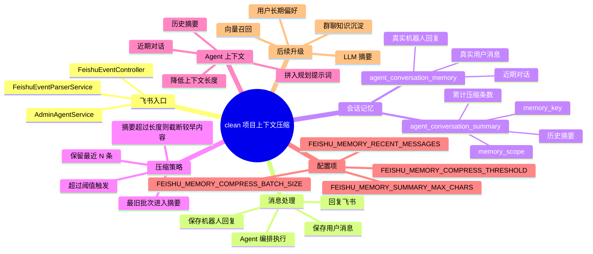

# clean 项目上下文压缩思维导图

下面是 `feishu-admin-ai-bot-clean` 当前会话记忆和 Agent 调用链的思维导图。

```mermaid
mindmap
  root((clean 项目上下文压缩))
    飞书入口
      FeishuEventController
      FeishuEventParserService
      AdminAgentService
    消息处理
      保存用户消息
      Agent 编排执行
      保存机器人回复
      回复飞书
    会话记忆
      agent_conversation_memory
        真实用户消息
        真实机器人回复
        近期对话
      agent_conversation_summary
        历史摘要
        累计压缩条数
        memory_scope
        memory_key
    压缩策略
      超过阈值触发
      保留最近 N 条
      最旧批次进入摘要
      摘要超过长度则截断较早内容
    Agent 上下文
      历史摘要
      近期对话
      拼入规划提示词
      降低上下文长度
    配置项
      FEISHU_MEMORY_COMPRESS_THRESHOLD
      FEISHU_MEMORY_RECENT_MESSAGES
      FEISHU_MEMORY_COMPRESS_BATCH_SIZE
      FEISHU_MEMORY_SUMMARY_MAX_CHARS
    后续升级
      LLM 摘要
      向量召回
      用户长期偏好
      群聊知识沉淀
```
